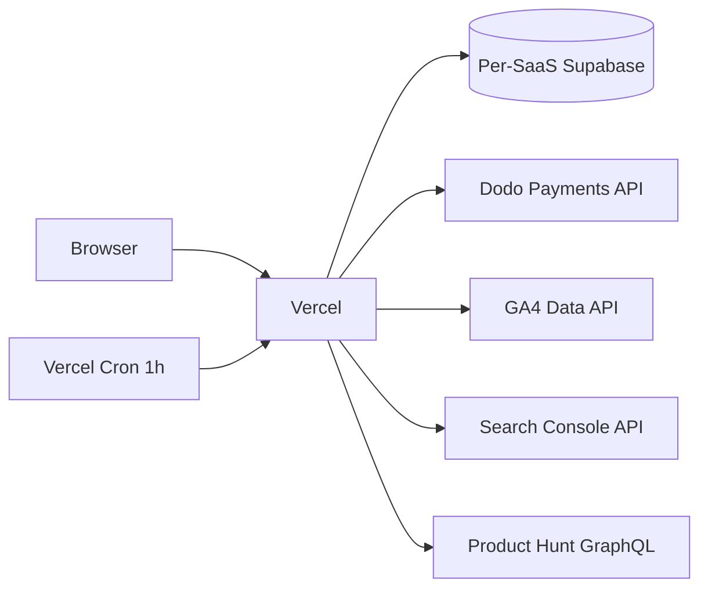

# saas-tracker

Portfolio dashboard for tracking SaaS launch gates — currently Lirefin, with room for **at most one more** product. Deployed to **looktoprice.com**.

## The 2-slot rule

The dashboard caps the portfolio at `MAX_PORTFOLIO_SIZE = 2`. Adding a
3rd product makes the build fail (assertion in
[`src/lib/products.ts`](src/lib/products.ts)). When a product hits
`KILL` after the 60-day test, run [KILL-PROTOCOL.md](KILL-PROTOCOL.md)
to free the slot **completely** (Vercel project, Supabase project, Dodo
product, env vars, registry entry) before queuing the next idea.

The dashboard surfaces the same protocol on `/saas/<slug>` whenever the
gate decision is KILL.

## What it shows

- **Per-SaaS gate scoring** (PASS / FAIL / GREY / PENDING) following the SaaS portfolio strategy in the parent project: Gate 1 (days 1–30) and Gate 2 (days 31–60), with kill / scale / extend rules.
- **Revenue (Dodo)**: MRR, paying users, ARPU, monthly churn rate, refunds (30 d).
- **Acquisition**: signups (Supabase), GA4 sessions, GSC clicks/impressions, Product Hunt upvotes.
- **Charts**: 60-day MRR trend and signup curve.
- **Ads (later)**: spend, CPC, conversions once Google Ads developer token is approved.

## How data flows



## Adding a SaaS

If the portfolio is already full (`PRODUCTS.length === 2`), kill an
existing product first via [KILL-PROTOCOL.md](KILL-PROTOCOL.md). Then:

1. Add env vars in Vercel (see `.env.example`).
2. Add an entry to [`src/lib/products.ts`](src/lib/products.ts).
3. Implement the SaaS-specific Supabase queries in `src/lib/queries/<slug>.ts` if its schema differs from Lirefin's.
4. Redeploy.

## Starting the 60-day window

Gate 1's `signups`, `landing visitors`, `CPC`, and `PH upvotes`
thresholds assume distribution is actually running. Don't trip the
day-30 hard kill on a product whose Ads campaign isn't even live yet.

The day **all three channels** are open simultaneously — Ads campaign
live + Product Hunt launched + Outrank publishing — set
`<SLUG>_TEST_START_DATE=YYYY-MM-DD` in Vercel and redeploy. The
dashboard's day counter resets, the 60-day gate window starts on
that date.

If the env is unset, the test starts on the day of the most recent
deploy — fine while you're scaffolding, dangerous in steady state.

## Local dev

```bash
pnpm install
cp .env.example .env.local   # fill in values
pnpm dev
```

## Auth model

The dashboard is locked behind **Vercel Deployment Protection (password)** — no auth code in the app itself, since it is a single-user tool. Robots are also blocked at the HTTP-header level (`X-Robots-Tag: noindex, nofollow`).

## License

Private — no public license intended.
