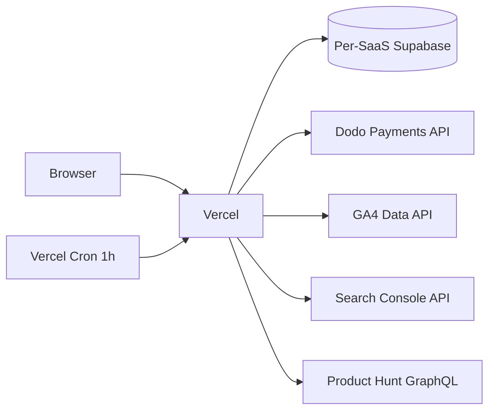

# saas-tracker

Portfolio dashboard for tracking SaaS launch gates — currently Lirefin, with room for the next products in the pipeline. Deployed to **looktoprice.com**.

## What it shows

- **Per-SaaS gate scoring** (PASS / FAIL / GREY / PENDING) following the SaaS portfolio strategy in the parent project: Gate 1 (days 1–30) and Gate 2 (days 31–60), with kill / scale / extend rules.
- **Revenue (Dodo)**: MRR, paying users, ARPU, monthly churn rate, refunds (30 d).
- **Acquisition**: signups (Supabase), GA4 sessions, GSC clicks/impressions, Product Hunt upvotes.
- **Charts**: 60-day MRR trend and signup curve.
- **Ads (later)**: spend, CPC, conversions once Google Ads developer token is approved.

## How data flows



## Adding a SaaS

1. Add env vars in Vercel (see `.env.example`).
2. Add an entry to [`src/lib/products.ts`](src/lib/products.ts).
3. Implement the SaaS-specific Supabase queries in `src/lib/queries/<slug>.ts` if its schema differs from Lirefin's.
4. Redeploy.

## Local dev

```bash
pnpm install
cp .env.example .env.local   # fill in values
pnpm dev
```

## Auth model

The dashboard is locked behind **Vercel Deployment Protection (password)** — no auth code in the app itself, since it is a single-user tool. Robots are also blocked at the HTTP-header level (`X-Robots-Tag: noindex, nofollow`).

## License

Private — no public license intended.
